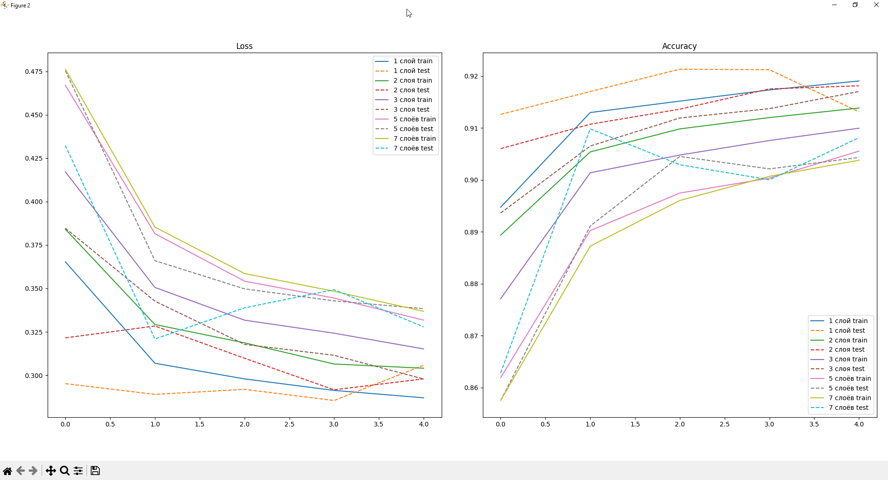
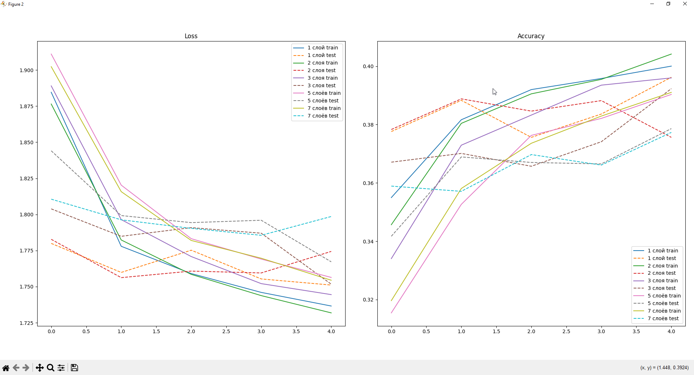
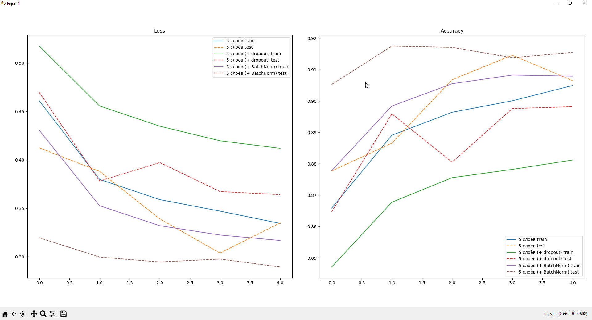
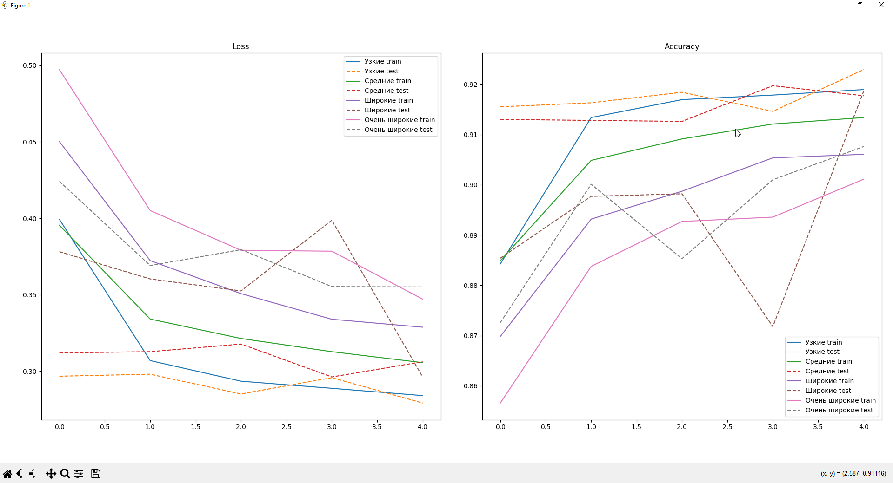
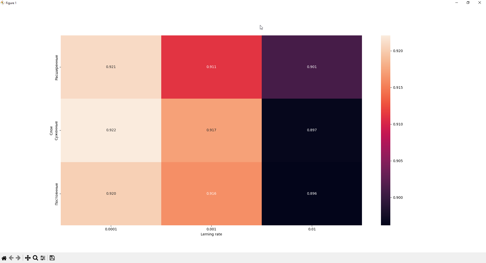
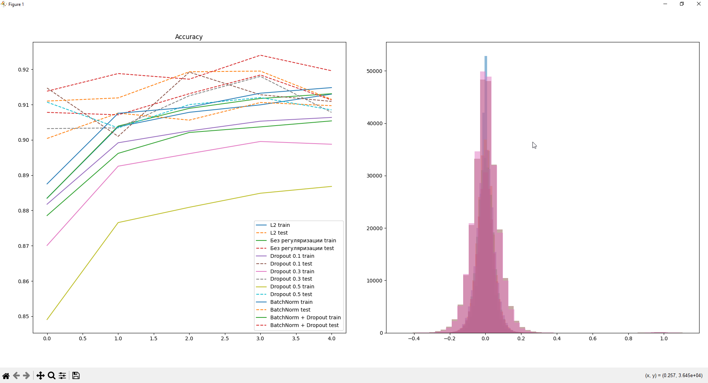

### Выполнил: Багрецов Ярослав Олегович

## Задание 1: Эксперименты с глубиной сети

### 1.1 Сравнение моделей разной глубины

Сравните точность на train и test

    В основном test немного превышает train, но не столь значительно

### Графики для MNIST с разной глубиной

### 1.2 Анализ переобучения
    
Определите оптимальную глубину для каждого датасета

    Исходя из графиков в пункте 1.1, на MNIST наилучшим образом себя показала сеть с глубиной 2, дав высокий Accuracy и не начав переобучаться на 5ой эпохе

    Таким же образом были построены графики для CIFAR, они получились более хаотичными и Accuracy получился довольно низким

### Графики для CIFAR с разной глубиной

Добавьте Dropout и BatchNorm, сравните результаты

    Особых изменений не последовало, за исключением того, что график с BatchNorm стал более стабильным

Проанализируйте, когда начинается переобучение
    Переобучение началось на 5ой эпохе. Точность test либо просела, либо осталось той же, а train продолжил расти

### Графики для MNIST c добавлением Dropout и BatchNorm

## Задание 2: Эксперименты с шириной сети

### 2.1 Сравнение моделей разной ширины
Количество параметров:

    Узкие 53018
    Средние 242762
    Широкие 1462538
    Очень широкие 4235786

Время обучения:

    Модель Узкие обучилась за 69.653000831604 секунд
    Модель Средние обучилась за 75.47526836395264 секунд
    Модель Широкие обучилась за 76.87699890136719 секунд
    Модель Очень широкие обучилась за 83.17754888534546 секунд

Сравните точность и время обучения. Проанализируйте количество параметров

    Время обучения прямопропорционально ширине слоёв и количеству параметров, но не имеет чёткой корелляции с точностью

### Графики для MNIST с разной шириной

### 2.2 Оптимизация архитектуры

Используйте grid search для поиска лучшей комбинации

    Я провёл grid search на слои и Lerning Rate модели. Добаыил схемы сужения, расширения и постоянную, а также несколько вариантов lr

    Самой оптимальной оказалась схема сужения со скоростью обучения 0.0001

### Тепловая карта grid search для MNIST

## Задание 3: Эксперименты с регуляризацией

### 3.1 Сравнение техник регуляризации
    С помощью различных техник регуляризации получилось добиться улучшения обобщающей способности модели. Переобучение стало проявляться позже и не так сильно

    Dropout снижает переобучение за счёт случайного отключения нейронов, что делает модель менее зависимой от отдельных признаков

    BatchNorm стабилизирует процесс обучения, делая его более плавным

    L2 ограничивает значения весов: веса становятся менее разбросанными
    
### Графики с регуляризацией и визуализация весов

